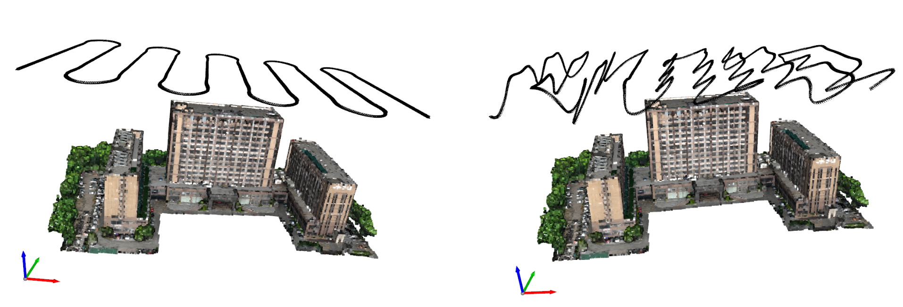

# Photogrammetry Software
This repo mainly includes basic module for photogrammetry based on unmanned aerial vehicle. Important features include:
- UAV Path Planing
- Structure from Motion for Pose Estimation
- Multi-View Stereo for Dense Reconstruction
- Texture Mapping
- Rendering

## Pre-requisite
The code is tested on a Linux machine of Ubuntu 20.04 with RTX 4090. \
CUDA 12.0 \
Eigen 3.4.0 \
Ceres 2.1.0 \


## How to use
```shell
# get the mission planning software
git clone https://github.com/Haonan-DONG/photogrammetry_software.git --recursive

## compile the third library mve
cd mve
make -j

## compile the root
cmake .. -DMVE_ROOT=../third_party/uavmvs/elibs/mve/
make -j

## path planning
bash shell/mission_plan.sh

# compile colmap 

# compile openMVS
 cmake -DVCG_ROOT=[VCG_REPO_PATH] -DEigen3_DIR=[Eigen3_INSTALL_PATH] -DCGAL_DIR=[CGAL_INSTALL_PATH] -DBoost_ROOT=[Boost_INSTALL_PATH] ..
```
## Data and Run
### Mission Plan
The demo data is uploaded into [baidu disk, psw:7z9n](https://pan.baidu.com/s/1E1aecb8SpcAujOZ3HdEazg?pwd=7z9n), After running the mission_plan shell, the path will be visualized as follows:



## TODO
- [X] Add Mission planning code for DJI platform.
    - [X] Change uavmvs in a cmake lib
        - [X] Add MVE as the sfm basic lib
    - [X] Test the ndair and oblique path planning
    - [X] Test the optimized path planning
- [X] Released Pipeline for COLMAP for SfM.
- [X] Add openMVS as a library. From rgb input into textured mesh.
- [ ] For large-scale dataset, incoorperate parallel-sfm module
- [ ] Add lite version to generate the real-time orthorectified image.
    - [ ] Add GPS info from the exiv file.
- [ ] Add Mesh refine module by line-constrain.

## Acknowledgements
- [uavmvs](https://github.com/nmoehrle/uavmvs)
- [COLMAP](https://github.com/colmap/colmap)
- [OpenMVS](https://github.com/cdcseacave/openMVS)
- [Poisson Reconstruction](https://www.cs.jhu.edu/~misha/Code/PoissonRecon/Version13.8/)
- [Meshlab](https://github.com/cnr-isti-vclab/meshlab)
- [OpenREALM](https://github.com/laxnpander/OpenREALM.git)
- [CGAL](https://github.com/CGAL/cgal.git)